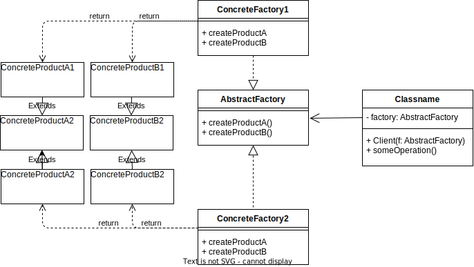

# Abstract Factory
## 概要
AbstractFactoryパターンは、オブジェクト生成を担当するクラス群を柔軟に管理する。関連するオブジェクトのファミリーを作成するためのインターフェースを提供し、具体的なクラスをクライアントから分離する。AbstractFactoryパターンの主な目的は、クライアントが具体的なオブジェクトの生成方法を知ることなく、オブジェクトのファミリーを生成できるようにすることである。

## クラス図

- AbstractFactory
AbstractFactory は、ConcreteFactory が実装すべきインターフェース。関連するオブジェクトのファミリーを生成するための一連のメソッドが定義されている。これらのメソッドは、具体的なオブジェクトの生成を担当する ConcreteFactory に委譲される。

- ConcreteFactory
ConcreteFactory は、AbstractFactoryインターフェースを実装するクラス。これらは、特定のオブジェクトのファミリーを生成する責任を持つ。クライアントは、ConcreteFactory を使用してオブジェクトを生成するが、具体的なクラスを直接参照することはない。

- AbstractProduct
AbstractProduct は、ConcreteProduct が実装すべきインターフェース。これにより、クライアントは ConcreteProduct の実装に依存せず、製品の共通のインターフェースを使用できる。

- ConcreteProduct
ConcreteProduct は、AbstractProduct インターフェースを実装するクラス。これらのクラスは、ConcreteFactory によって生成される。

- Client
クライアントは、AbstractFactory を使用してオブジェクトのファミリーを生成する。クライアントは、AbstractFactoryおよびAbstractProductのインターフェースに依存しており、ConcreteFactoryおよびConcreteProductの具体的な実装には依存しない。これにより、クライアントはオブジェクト生成の詳細から独立して、コードの柔軟性と拡張性が向上する。

## メリット
- 一貫性
AbstractFactory を使用すると、関連するオブジェクトのファミリーが一貫して生成されるため、クライアントは異なるファクトリーで生成されたオブジェクトが不整合になる心配がない。

- 交換可能性
ConcreteFactory を簡単に交換できるため、アプリケーションの異なる構成や状況に応じて、オブジェクトの生成方法を容易に変更できる。これにより、コードのメンテナンス性や拡張性が向上する。

- 低い結合度
クライアントは、AbstractFactory および AbstractProduct インターフェースにのみ依存しているため、具体的な実装の変更がクライアントに影響を与えることがない。これは、アプリケーション全体の結合度を低く保つことができるため、コードの変更や追加が容易になる。

- 再利用性
AbstractFactory パターンは、オブジェクト生成のロジックをカプセル化して再利用可能なコンポーネントとして提供するため、コードの重複を減らし、アプリケーションの全体的な再利用性が向上する。