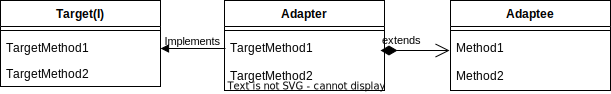

# Adapter
## 概要
別名 Wrapper パターン
「既に提供されているもの」を「利用できるもの」にするためのデザインパターン

## 利用場面
- 関連性のないクラス同士をクラスを変えずに関連付けする
- 既存クラスをある新しいインターフェースを通じて再利用したい場合
- 既存クラス・インターフェイスをアプリケーション固有なものにしたい場合

## クラス図

- 利用する側は Adapter を生成し、Target(インターフェースまたは抽象クラス)を利用する
- Adapter は継承または委譲を使って Adaptee を利用する

## メリット
- 既存のクラスを変更しなくても、新しいクラスを作成することでインターフェースが変更できる。既存のコードを再利用することができ、コードの修正や変更の範囲を限定できる。
- 既存のクラスと新しいクラスの間に、疎結合性を保つことができる。つまり新しいクラスが既存クラスの詳細に依存しないため、コードの保守性や拡張性が向上する。
- 既存のコードを再利用することができるため、開発時間が短縮する。
- 新しいクラスを作ることで、既存のクラスに新しい機能を追加する形でも実装できる。