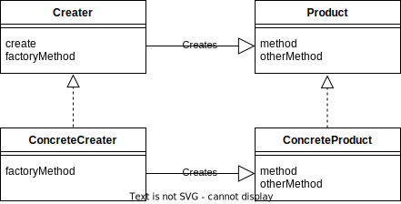

# Factory Method
## 概要
インスタンスの作り方をスーパークラスで定め、具体的な処理をサブクラスで行うパターン
Factory パターンの方が使用頻度は高い

## クラス図

## 具体例
抽象クラス
- Product :Productクラス
- Creator :Factoryクラス

具象クラス
- ConcreteCreator :AccountFactoryクラス
- ConcreteProduct :Accountクラス

## メリット
- 柔軟性が高い
Factory Methodパターンを使用することで、クラスのインスタンス生成方法を変更することが容易になる。例えば、インスタンス生成のロジックが変更された場合、Factory Methodパターンを使用することで、クライアント側に影響を与えずに変更することができる。

- 再利用性が高い
Factory Methodパターンを使用することで、同じクラスの複数のインスタンスを生成する際に、生成コードを共通化することができる。これにより、コードの重複を避けることができ、保守性や拡張性を高めることができる。

- カプセル化
Factory Methodパターンを使用することで、クラスの具体的な実装を隠蔽することができる。つまり、クラスのインスタンス生成方法についてはFactory Method内で完結させることができ、クライアント側からは見えなくすることができる。これにより、クラスの内部実装を変更することができるため、保守性を高めることができる。

- 拡張性が高い
Factory Methodパターンを使用することで、クラスのサブクラスによる拡張が容易になる。つまり、新しいクラスを追加する場合には、新しいFactory Methodを定義することで、既存のクライアントコードに影響を与えることなく、新しいクラスを利用することができる。

## デメリット
- 追加コード・クラス数が多くなる
Factory Methodパターンを使用することで、クラス階層に対してFactory Methodを定義する必要がある。これにより、コードの量が増える可能性がある。
クラス階層ごとにFactory Methodを定義する必要があるため、クラスの数が膨大になる可能性がある。

- 間接的な呼び出しによるパフォーマンス低下
actory Methodパターンを使用する場合、インスタンス生成のためにFactory Methodを呼び出す必要がある。このため、間接的な呼び出しが発生し、パフォーマンスの低下を引き起こす可能性がある。