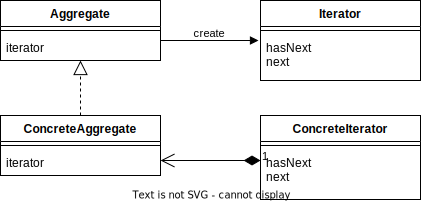

# Iterator パターン
## 概要
単語自体は<b>繰り返す、反復する</b>等の意味を持つ。
集合体（例えば、配列、リスト、マップなど）の要素に順番にアクセスするための方法を提供するパターン。

## 使用ケース
- アプリケーション固有なデータ、構造を持ったオブジェクトにアクセスする場合
- 配列やコレクションなどの集合する要素にアクセスする場合
- 集合の要素に順次にアクセスする必要がある場合

## Iterator パターンのクラス図

## 具体例
- ConcreteAggregate クラス => BookShelf
- BookShelf クラスは複数の Book クラスを持つ
- ConcreteIterator クラス => BookShelfIterator

## 使用する汎用メソッド
1. next()
    次の要素を返す(現在要素を返し、次の位置に進める)

2. hasNext()
    次の要素が存在するか調べ、真偽値を返す

## メリット
1. 汎用性が高い：Iterator パターンは、どのような集合体でも使用することができる。そのため、同じ Iterator クラスを使用して、異なる集合体の要素にアクセスできる。したがって、クラスの再利用性が高くなる。
2. 隠蔽性が高い：Iterator パターンは、集合体の内部実装を隠蔽することができる。つまり、クライアントは集合体の内部実装を知らずに、Iteratorを使用して集合体の要素にアクセスすることができる。そのため、集合体の内部実装が変更された場合でも、Iteratorクラスは変更する必要がなく、既存のクライアントコードに影響を与えることがない。
3. 拡張性が高い：Iterator パターンは、新しい集合体を追加する場合に簡単に拡張できる。新しい集合体には、同じIteratorインターフェースを実装するだけでよく、Iteratorの実装は変更する必要がない。
4. 単純化されたクライアントコード：Iterator パターンを使用することで、クライアントコードが単純化される。クライアントは、Iteratorクラスのメソッドを呼び出すだけで、集合体の要素にアクセスできる。