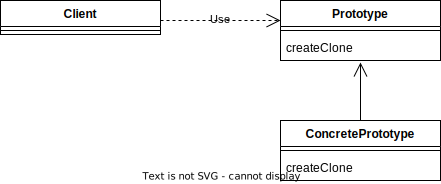

# Prototype
## 概要
クラスからインスタンスを生成するのではなく、インスタンスから別のインスタンスを(コピーして)生成するパターン

## クラス図

- Prototype
インスタンスを複製して、新しいインスタンスを生成するメソッドを定める
- ConcretePrototype
実際にインスタンスを複製して、新しいインスタンスを生成するメソッドを実装
- Client
実際にインスタンスを複製して新しいインスタンスを生成する役割を担う

## メリット
- 新しいオブジェクトを作成する際に、既存のオブジェクトを複製することにより、同じようなオブジェクトを簡単かつ迅速に作成できる。これにより、同じようなオブジェクトを何度も作成する必要がある場合に非常に便利。
- Prototypeパターンを使用することにより、新しいオブジェクトを作成する際に必要なリソースを大幅に削減できる。新しいオブジェクトを作成するために必要な処理を最小限に抑えることができる。
- Prototypeパターンは、オブジェクトの複雑な初期化を避けることができる。オブジェクトが複雑で初期化が複雑な場合、Prototypeパターンを使用することにより、オブジェクトの初期化プロセスを簡略化できる。
- Prototypeパターンは、オブジェクトのクラス階層を単純化することができる。クラス階層が複雑である場合、Prototypeパターンを使用することにより、クラス階層を簡素化し、オブジェクトの生成を容易にすることができる。
- Prototypeパターンは、オブジェクトの種類を動的に変更することができる。オブジェクトの種類を変更する必要がある場合、Prototypeパターンを使用することにより、オブジェクトの種類を簡単かつ迅速に変更することができる。

## 適するケース
- オブジェクトの生成コストが高い場合
オブジェクトを生成するために多くのリソースが必要である場合、Prototypeパターンを使用してオブジェクトを複製することで、オブジェクトの生成コストを減らすことができる。
- 多様なオブジェクトを生成する必要がある場合
異なる状態のオブジェクトを生成する必要がある場合、Prototypeパターンを使用してオブジェクトを複製し、必要に応じてカスタマイズすることができる。
- クラス階層が複雑である場合
クラス階層が複雑である場合、Prototypeパターンを使用して、クラス階層を単純化することができる。