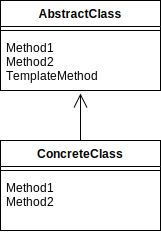

# Template Method
## 概要
スーパークラスで処理の枠組みを決め、サブクラスで具体的な内容を定めるデザインパターン

## クラス図

## メリット
- アルゴリズムの共通部分を一元化し、再利用性を高めることができます。共通部分は抽象クラスに定義されるため、サブクラスでは再実装する必要がない。そのため、アルゴリズムの変更や拡張が容易になる。

- 柔軟性を高めることができる。抽象クラスには、具体的な手順を実装するための抽象メソッドが含まれている。そのため、サブクラスは自由に手順を定義することができる。これにより、アルゴリズムのカスタマイズが可能になる。

- 一貫性を確保することができる。アルゴリズムの共通部分を抽象クラスに定義するため、全てのサブクラスで同じ手順が実行される。これにより、アルゴリズムの一貫性を確保することができる。

- コードの可読性を向上することができる。アルゴリズムの骨格が明確になるため、コードの可読性が向上する。また、共通部分と具体的な手順が明確に分かれるため、コードの保守性が向上することもある。